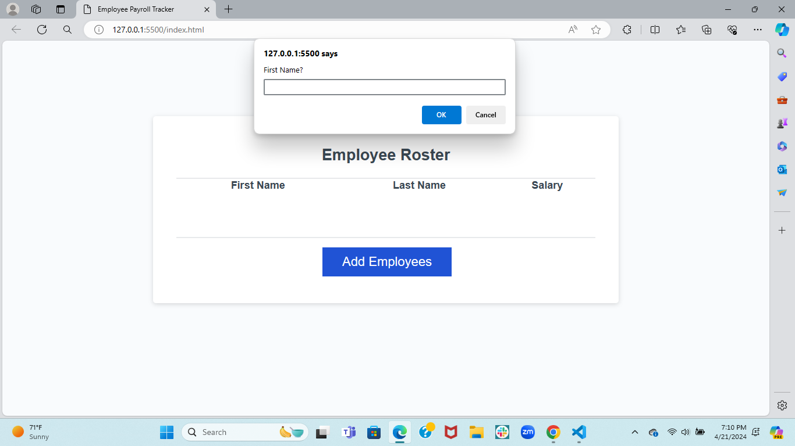

# Homework-3
Challenge 03- due 04/18/24 Completed by Faiza Haque for UCB Extension Coding Bootcamp

This week's Challenge requires you to modify starter code to create an application that enables a payroll manager to view and manage employee payroll data. This app will run in the browser and will feature dynamically updated HTML and CSS powered by JavaScript code that you write. It will have a clean and polished, responsive user interface that adapts to multiple screen sizes.

## Deployed Link
[deployed link](https://faiza-haque.github.io/Homework-3/)

## Screenshot of Project

 **User Story**: AS A payroll manager
I WANT AN employee payroll tracker
SO THAT I can see my employees' payroll data and properly budget for the company

 **Acceptance Criteria**: GIVEN an employee payroll tracker
WHEN I click the "Add employee" button
THEN I am presented with a series of prompts asking for first name, last name, and salary
WHEN I finish adding an employee
THEN I am prompted to continue or cancel
WHEN I choose to continue
THEN I am prompted to add a new employee
WHEN I choose to cancel
THEN my employee data is displayed on the page sorted alphabetically by last name, and the console shows computed and aggregated data